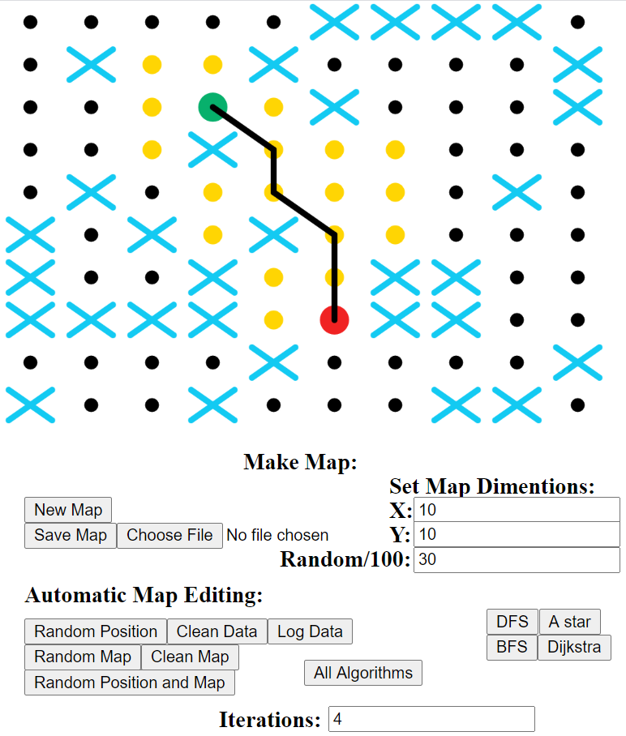

# Pathfinding in JS
This is a project that tried to analyse the main pathfinding algorithms that are used.
In the picture below you can see the interface we used to test the different algorithms.

There are a bunch of buttons below the canvas we used as well as some output windows to the right.
The most important buttons are "Randomize Map and Position" (Beneath "Automatic Map Editing" at the bottom) and the algorithm buttons "DFS, BFS, Dijkstra, A*" (in a cluster to the right of that).

The way I built it is such that every black dot is a node that can be travelled to. And you can 
travel between any adjacent nodes (both diagonal and cardinal). Any node that is a
cross cannot be travelled to. Every algorithm tries to
find the shortest path from the start (Green node) to the end (Red node). The yellow nodes are ones the 
algorithm being used has interacted with in some sort of way.

# Usage
The rest of the buttons and fields in the interface interact with the map in different ways.

To change the number of nodes, input the number of nodes you want (on one side) in the x, y fields, and press "new map" to the left of the fields.

The field below that is "Random/100" it expresses the percentage chance that any node is a cross after after pressing "random map" under
automatic map editing, by default it is at 30%. Random position randomizes the position of both the start and end nodes. "Random map and position" does both of these things at once, using the percentage in the field.

"Clean data" removes the data from the columns to the right (This was really important for data collection). "Clean Map" removes the line and yellow dots from the map. "Log Data" outputs the collected data to the console (In hindsight this could have used console.logTable). 

Lastly, "Save Map" allows you to download a copy of the map. And the upload file next to it allows you to upload a saved map to run algorithms on.

# Specification
It uses p5.js to draw everything. Other than that it was all built in JavaScript

# ToDo
- [ ] Fixup UI
- [ ] Add more to README about the algorithms used
- [ ] Add on page information

